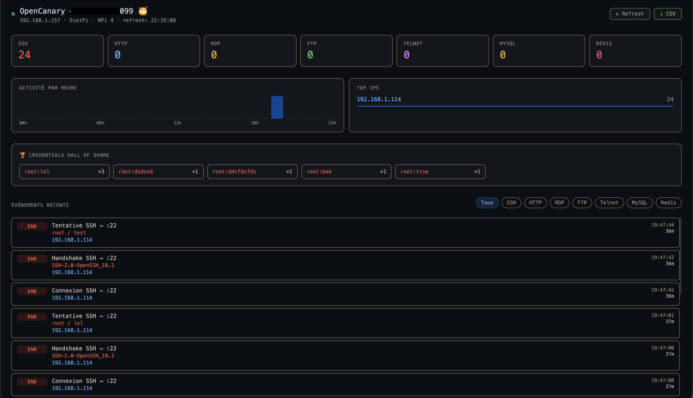

# 🍯 OpenCanary Dashboard

A lightweight Flask dashboard and Home Assistant notifier for [OpenCanary](https://github.com/thinkst/opencanary) honeypots.

Built on a Raspberry Pi 4 running DietPi, deployed on a home/office LAN for blue team practice and lateral movement detection.



---

## Features

- **Real-time dashboard** — auto-refreshes every 10 seconds without page reload
- **7 services monitored** — SSH, HTTP, RDP, FTP, Telnet, MySQL, Redis
- **Hourly activity chart** — visualize attack patterns over 24h
- **Top IPs** — with direct VirusTotal lookup links
- **Credentials hall of shame** — top username/password pairs attempted
- **Filter by service** — SSH, HTTP, RDP, FTP, Telnet, MySQL, Redis
- **CSV export** — download all events
- **Home Assistant notifications** — formatted push alerts to iPhone/Apple Watch via HA webhook

---

## Stack

- [OpenCanary](https://github.com/thinkst/opencanary) — honeypot engine
- [Flask](https://flask.palletsprojects.com/) — dashboard backend
- [Home Assistant](https://www.home-assistant.io/) — push notifications (optional)
- Raspberry Pi 4 + [DietPi](https://dietpi.com/)

---

## Installation

### 1. Install OpenCanary

```bash
apt install python3-pip python3-venv libssl-dev libffi-dev -y
python3 -m venv /opt/opencanary-env
source /opt/opencanary-env/bin/activate
pip install opencanary
opencanaryd --copyconfig
```

Edit `/etc/opencanaryd/opencanary.conf` to enable the services you want, then start:

```bash
opencanaryd --start
```

### 2. Install the dashboard

```bash
git clone https://github.com/Bluewall/opencanary-dashboard.git
cd opencanary-dashboard
pip install -r requirements.txt
```

### 3. Configure

```bash
cp .env.example .env
nano .env
```

Set `OPENCANARY_LOG` to your OpenCanary log path and `HA_WEBHOOK_URL` if you want Home Assistant notifications.

### 4. Run

```bash
# Dashboard
python app.py

# HA notifier (optional)
export HA_WEBHOOK_URL=http://homeassistant.local:8123/api/webhook/your-id
python ha_notify.py
```

---

## Run as systemd services

**Dashboard:**

```bash
cat > /etc/systemd/system/opencanary-dashboard.service << 'EOF'
[Unit]
Description=OpenCanary Dashboard
After=network.target opencanary.service

[Service]
User=root
WorkingDirectory=/opt/opencanary-dashboard
EnvironmentFile=/opt/opencanary-dashboard/.env
ExecStart=/opt/opencanary-env/bin/python app.py
Restart=on-failure

[Install]
WantedBy=multi-user.target
EOF

systemctl daemon-reload
systemctl enable --now opencanary-dashboard
```

**HA Notifier:**

```bash
cat > /etc/systemd/system/opencanary-notify.service << 'EOF'
[Unit]
Description=OpenCanary HA Notifier
After=network.target opencanary.service

[Service]
User=root
EnvironmentFile=/opt/opencanary-dashboard/.env
ExecStart=/opt/opencanary-env/bin/python /opt/opencanary-dashboard/ha_notify.py
Restart=on-failure

[Install]
WantedBy=multi-user.target
EOF

systemctl daemon-reload
systemctl enable --now opencanary-notify
```

---

## Home Assistant automation

Create a webhook automation in HA with this YAML:

```yaml
alias: OpenCanary Alert
triggers:
  - trigger: webhook
    allowed_methods:
      - POST
    local_only: true
    webhook_id: "your-webhook-id"
conditions: []
actions:
  - action: notify.mobile_app_your_device
    data:
      title: "{{ trigger.json.title }}"
      message: "{{ trigger.json.message }}"
mode: single
```

---

## Why a honeypot on a home/office LAN?

A honeypot on an internal network has no legitimate reason to be contacted. Any connection is suspicious — a scanning device, an infected machine doing lateral movement, or an unknown device that just connected.

This is particularly useful for detecting:
- Personal laptops connected to an office network (no MDM = invisible to endpoint protection)
- IoT devices behaving unexpectedly
- Post-compromise lateral movement

---

## License

MIT

---

*Built by [@Bluewall](https://infosec.exchange/@Bluewall) — Responsable Informatique & Sécurité, Blue Team enthusiast*
